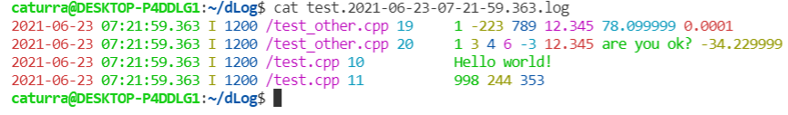

# dlog

## TL; DR

- 易用，直接把`dlog.hpp`带走即可
- 极快，详见下方`spdlog`和`glog`的benchmark对比
- 丰富扩展，想要的功能基本都有，提供静态接口扩展


## Install

1. 你可以直接把`dlog.hpp`拷到你的项目中使用
2. 也可以把`/src`下面的文件拷过去，都是`header-only`的方式，在项目中包含`log.h`即可

但不管哪种方式，你都需要一个`.conf`文件来描述`dlog`的行为，将会在后面feature介绍


## Platform

- Linux (or Unix-like)
- C++14
- g++


## Feature

### 基本特性

- 支持日志等级、线程ID、日期、文件名和行数
- 支持日志分割，可按文件大小和时间分割
- 支持日志等级过滤
- 支持输出对齐
- 支持输出路径定制

### 高级特性

- 支持日志高亮
- 支持运行时过滤相同、相似日志（基于`simhash`算法实现）
- 支持任意对象类型输出日志
- 任意你想要的输出定制及组合使用方式

基本特性部分由`dlog.conf`文件来描述，见下方`dlog.conf`说明

高级特性的使用需要了解模板特化，定制需要了解CRTP（奇异递归模板模式）、装饰器模式


## dlog.conf

`dlog.conf`是**编译时**描述`dlog`的配置文件，示例如下

```C++
config {
    log_path {                              // 输出文件定制
        log_dir {"."},                      // 目录
        log_filename {"test"},              // 文件名
        log_filename_extension {".log"}     // 扩展名
    },
    log_filter {                            // 过滤日志，只有显式声明才会输出
        DEBUG,                              // option: DEBUG INFO WARN ERROR WTF
        INFO,
        WARN
    },
    file_max_size {                         // 文件大小限制，超出部分会进行日志分割
        100MB                               // option: B KB MB GB
    },                                      // 你可以在不同单位上进行简单算术运算，如 1GB + 2MB
    file_rolling_interval {                 // 日志超时分割，每一个时间段也会进行分割
        24h                                 // option: h m s，同样支持算术运算
    },
    msg_align {                             // 日志对齐，数值为空格数
        15
    }
}
```

你也可以什么都不写，留下一个空文件，但必须要有

你也可以只写部分的描述，不用全部写，但是默认行为不一定符合你的意思

你也可以不用`dlog.conf`这个名字，但我不想告诉你怎么做

PS. 你可能以为这是某种DSL，其实整个`dlog.conf`文件也是`C++`代码


## Usage (basic)

`dlog`的API非常直观，每一种日志等级对应一个接口

并且提供三种使用风格：

- `Log::info`： 原生日志，启用部分基本特性，不输出文件名和行数，没有对齐
- `DLOG_INFO`： 宏定义风格，启用部分基本特性，输出文件名和行数，但不提供对齐
- `DLOG_INFO_ALIGN`：宏定义风格，启用全部基本特性

这里的`info`可改为`debug` / `warn` / `error` / `wtf`，宏定义风格则用大写

日志函数均可用于任意线程

```C++
#include <bits/stdc++.h>
#include "dlog.hpp"

int main() {
    using namespace dlog;
    Log::init();  // 必须先初始化
    Log::info(1, -223ll, "789", "12.345", 78.1, 0.0001);
    Log::debug(1, 3, 4, 6, -3, 12.345, "are you ok?", -34.23);
    DLOG_ERROR("Hello world!");
    DLOG_WARN_ALIGN(998, 244, "353");
    return 0;
}
```

输出示例

```C++
2021-06-22 05:14:34.845 I 1350 1 -223 789 12.345 78.099999 0.0001
2021-06-22 05:14:34.845 D 1350 1 3 4 6 -3 12.345 are you ok? -34.229999
2021-06-22 05:14:34.845 E 1350 /test.cpp 9 Hello world!
2021-06-22 05:14:34.845 W 1350 /test.cpp 10           998 244 353
```

默认情况下使用单个空格分离，可以通过policy定制为任意形式的输出方案，如下所示



要了解如何使用和定制policy可见下方文档


## Benchmark

测试日志均包含`date` / `time` /`thread-id` /`filename` / `line`/ `log-level`

每线程生成`1,000,000`条日志

具体test case见`/bench`

```
                  test       cost(ms)       total(msg)       consume(msg/sec)
   [spdlog-basic st 1]            475          1000000             2105263.16
   [spdlog-basic mt 2]           1051          2000000             1902949.57
   [spdlog-basic mt 4]           2470          4000000             1619433.20
   [spdlog-basic mt 8]           6486          8000000             1233425.84
 [spdlog-async mt 2 b]           2058          2000000              971817.30
 [spdlog-async mt 4 b]           9206          4000000              434499.24
 [spdlog-async mt 8 b]          20203          8000000              395980.79
 [spdlog-async mt 2 d]           1213          2000000             1648804.62
 [spdlog-async mt 4 d]           2368          4000000             1689189.19
 [spdlog-async mt 8 d]           4468          8000000             1790510.30
           [glog st 1]           1859          1000000              537923.61
           [glog mt 2]           2842          2000000              703729.77
           [glog mt 4]           2839          4000000             1408946.81
           [glog mt 8]          14552          8000000              549752.61
     [dlog-macro st 1]            264          1000000             3787878.79
     [dlog-macro mt 2]            423          2000000             4728132.39
     [dlog-macro mt 4]            508          4000000             7874015.75
     [dlog-macro mt 8]           1342          8000000             5961251.86

* st = single thread
* mt = multi threads
```

可以看出dlog的性能远高于市面上的主流logger


## Documents

[dlog的设计](doc/dlog-design.md)

[dlog的优化技巧](doc/dlog-performance-tricks.md)

[dlog的policy使用和定制](doc/dlog-policy.md)